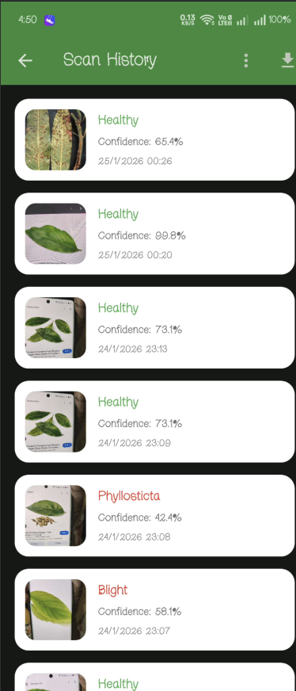
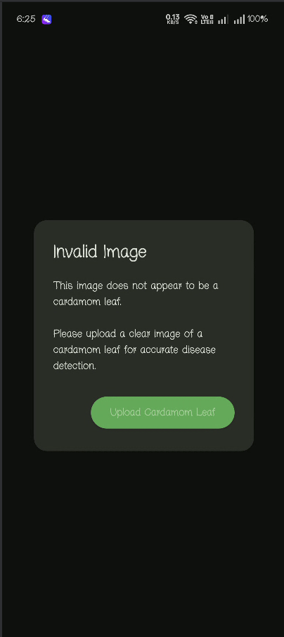

# 🌿 Cardamom Leaf Disease Detection App

An AI-powered mobile application built with **Flutter** and **TensorFlow Lite** to detect diseases in **cardamom leaves**. The app uses a **multi-stage validation pipeline** to ensure reliable predictions and to **reject invalid or non-cardamom images**.

---
## 🚀 Features
### 🤖 AI & Detection
- **MobileNetV2** TFLite model for 3-class disease classification
  - 🟠 **Blight** 
  - 🔴 **Phyllosticta Leaf Spot** 
  - 🟢 **Healthy Leaf**
- **GradCAM Heatmap** 
- **Stage Classification** 
- **Spot Counter** 
- **Confidence Score** 

### 📷 Input & Segmentation
- 📸 Capture leaf image using device camera
- 🖼️ Upload from gallery
- ✂️ **SAM Segmentation** (Segment Anything Model) 
- 🔍 Multi-stage image validation:
  - Format & quality check
  - **Blur detection** (Laplacian variance)
  - **Leaf heuristic** (green pixel ratio)

### 📊 Results & History
- Detailed result screen with disease name, stage, affected area %, spot count
- **Scan History** 
- **GradCAM regeneration** 
- **PDF Export** 

### 🌍 Multilingual Support
- 🇬🇧 **English**
- 🌴 **Malayalam** (മലയാളം)
- 🌺 **Tamil** (தமிழ்)

### 📋 Recommendations
- Disease-specific treatment advice with fungicide names and dosages
- Agri helpline integration (Kisan Call Centre 1800-180-1551)
- Weather warning card for disease risk conditions

---

## 📱 Screenshots

### 🏠 Home Screen


### 📜 Scan History


### 🧪 Disease Detection Result


### ❌ Invalid Image Rejection


---

## 🛠️ Tech Stack

* **Flutter** (UI)
* **Dart** (Logic)
* **TensorFlow Lite** (ML inference)
* **MobileNet-based CNN models**
* **Path Provider** (local storage)

---

## 📂 Project Structure 

```
lib/
├── core/
|   ├── localization/
|   |     ├── app_strings.dart
│   |     └── app_language.dart
│   ├── models/
|   |     ├── sam_prompt.dart
│   ├     └── scan_result.dart
│   └── utils/
|        ├── image_cropper.dart
│        ├── image_quality.dart
|        ├── image_resize.dart
|        ├── leaf_validator.dart
│        └── image_validatior.dart
├── Features/
│     ├── camera
|     |      ├── camera_screnn.dart
|     |      ├── full_image_viewer.dart
|     |      ├── image_preview_screen.dart
|     |      └── sam_interaction_screen.dart
│     ├── history
|     |       └── history.dart
│     ├── navigation
|     |      ├── home_screen.dart
|     |      └── main_navigation.dart
│     └── result
|             └── result.dart
├── services/
│      ├── ml
|      |     ├── classifier.dart
|      |     ├── inference_isolate.dart
|      |     ├── sam_service.dart
|      |     └── tflite_service.dart
|      ├── model_service.dart
|      ├── prediction_cache.dart
│      └── scan_storage.dart
├── widgets/
|   ├── agri_helpine_button.dart
|   ├── confidence_bar.dart
|   ├── guideline_tflite.dart
|   ├── language_option_tile.dart
│   ├── loading_overlay.dart
│   └── weather_warning_card.dart
└── main.dart
```

---

## ⚙️ How to Run

1. Clone the repository
2. Run `flutter pub get`
3. Connect an Android device or emulator
4. Run `flutter run`


## 📄 License

This project is for academic and demonstration purposes.
