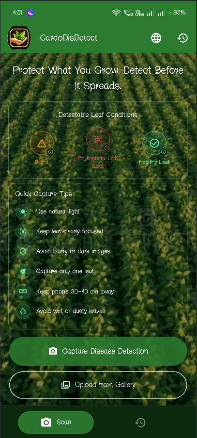
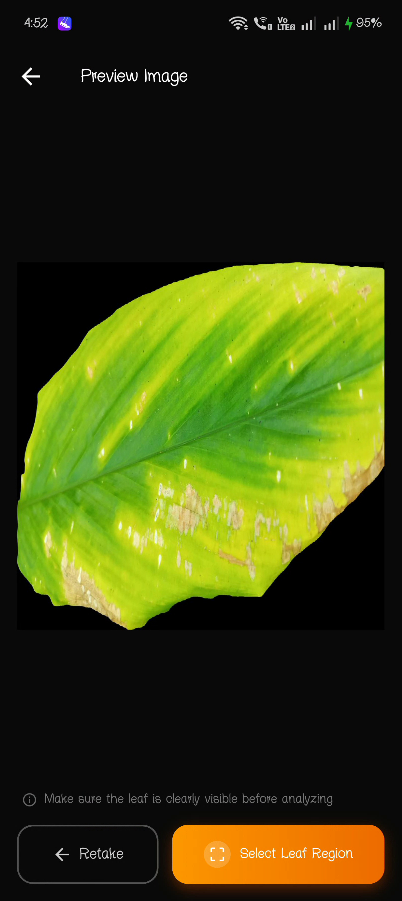
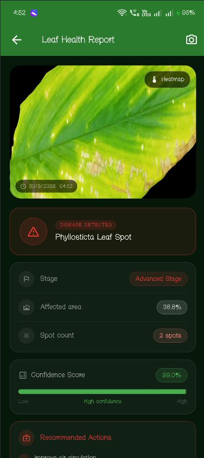
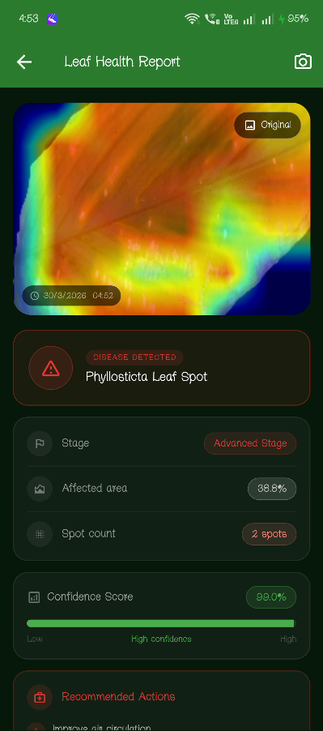
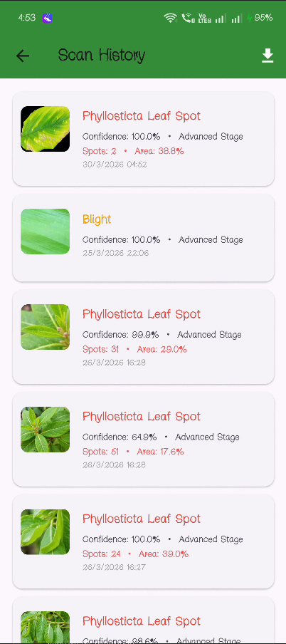
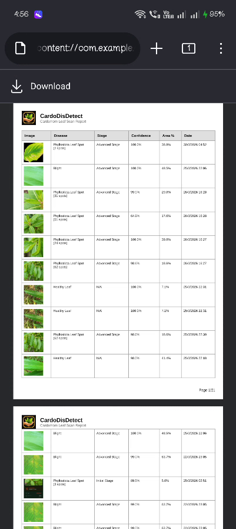
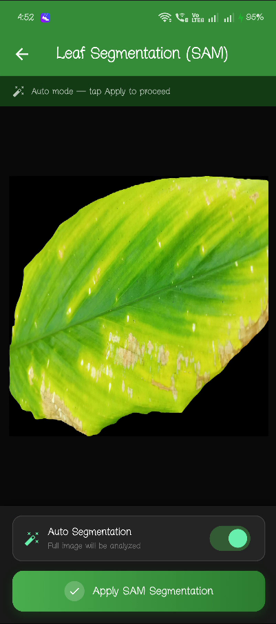
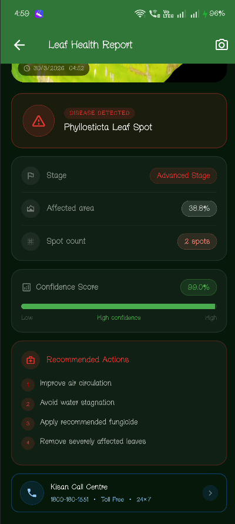

# 🌿 Cardamom Leaf Disease Detection App

An AI-powered mobile application built with **Flutter** and **TensorFlow Lite** to detect diseases in **cardamom leaves**. The app uses a **multi-stage validation pipeline** to ensure reliable predictions and to **reject invalid or non-cardamom images**.


---

## 📱 Screenshots

| Home Screen | Image Preview | Result Screen |
|:-----------:|:-------------:|:-------------:|
|  |  |  |

| Result with Heatmap | History Screen | PDF Export |
|:-------------------:|:--------------:|:----------:|
|  |  |  |

| SAM Segmentation | Disease Info |
|:----------------:|:------------:|
|  |  |

---

---
## 🚀 Features
### 🤖 AI & Detection
- **MobileNetV2** TFLite model for 3-class disease classification
  - 🟠 **Blight** 
  - 🔴 **Phyllosticta Leaf Spot** 
  - 🟢 **Healthy Leaf**
- **GradCAM Heatmap** 
- **Stage Classification** 
- **Spot Counter** 
- **Confidence Score** 

### 📷 Input & Segmentation
- 📸 Capture leaf image using device camera
- 🖼️ Upload from gallery
- ✂️ **SAM Segmentation** (Segment Anything Model) 
- 🔍 Multi-stage image validation:
  - Format & quality check
  - **Blur detection** (Laplacian variance)
  - **Leaf heuristic** (green pixel ratio)

### 📊 Results & History
- Detailed result screen with disease name, stage, affected area %, spot count
- **Scan History** 
- **GradCAM regeneration** 
- **PDF Export** 

### 🌍 Multilingual Support
- 🇬🇧 **English**
- 🌴 **Malayalam** (മലയാളം)
- 🌺 **Tamil** (தமிழ்)

### 📋 Recommendations
- Disease-specific treatment advice with fungicide names and dosages
- Agri helpline integration (Kisan Call Centre 1800-180-1551)
- Weather warning card for disease risk conditions

---

---

## 🛠️ Tech Stack

* **Flutter** (UI)
* **UI Framework**
* **Language** (Dart) 
* **TensorFlow Lite** (ML inference)
* **MobileNetV2**
* **GradCAM**
* **Path Provider** (local storage)

---

## 📂 Project Structure 

lib/
├── core/
│   ├── localization/
│   │   ├── app_language.dart        # Language enum (EN / ML / TA)
│   │   └── app_strings.dart         # All UI strings in 3 languages
│   ├── models/
│   │   ├── sam_prompt.dart          # SAM segmentation prompt model
│   │   └── scan_result.dart         # Scan result data model
│   └── utils/
│       ├── image_quality.dart       # Blur detection (Laplacian)
│       ├── image_resize.dart        # Resize to 224×224
│       ├── image_validator.dart     # Format & file validation
│       └── leaf_validator.dart      # Green pixel heuristic
│
├── features/
│   ├── camera/
│   │   ├── camera_screen.dart       # Home screen with capture/gallery
│   │   ├── full_image_viewer.dart   # Full-screen image + heatmap viewer
│   │   ├── image_preview_screen.dart # Preview before analysis
│   │   └── sam_interaction_screen.dart # SAM segmentation UI
│   ├── history/
│   │   └── history_screen.dart      # Scan history + PDF export
│   ├── navigation/
│   │   ├── home_screen.dart
│   │   └── main_navigation.dart     # Bottom nav with animated pill
│   └── result/
│       └── result_screen.dart       # Detection result + heatmap
│
├── services/
│   ├── ml/
│   │   ├── tflite_service.dart      # MobileNetV2 + GradCAM inference
│   │   ├── gradcam_helper.dart      # GradCAM CAM generation + jet colormap
│   │   ├── stage_classifier.dart    # Initial / Advanced stage logic
│   │   ├── spot_counter.dart        # Phyllosticta spot counting (HSV)
│   │   ├── sam_service.dart         # SAM segmentation service
│   │   └── inference_isolate.dart   # Background inference isolate
│   ├── model_service.dart           # Full pipeline orchestrator
│   ├── prediction_cache.dart        # Cache for repeated predictions
│   └── scan_storage.dart            # SharedPreferences scan history
│
├── widgets/
│   ├── agri_helpline_button.dart    # Kisan Call Centre button
│   ├── confidence_bar.dart          # Animated confidence progress bar
│   ├── guideline_tile.dart          # Expandable guideline tile
│   ├── language_option_tile.dart    # Language selector tile
│   ├── loading_overlay.dart         # Full-screen loading overlay
│   └── weather_warning_card.dart    # Weather disease risk card
│
└── main.dart

---

## ⚙️ Pipeline Architecture

```
  Image Capture / Gallery
             ↓
SAM Segmentation (Auto / Manual)
             ↓
┌──ModelService.runPipeline()──┐
│  1. ImageValidator           │
│  2. ImageQuality             │
│  3. LeafValidator            │
│  4. ImageResize              │
│  5. TFLiteService            │
│                              │
│  6. Confidence check         │
│  7. TFLiteService            │
│  8. StageClassifier          │
│  9. SpotCounter              │
└──────────────────────────────┘
             ↓
         ScanResult
             ↓
ResultScreen (disease + stage + confidence + heatmap)
             ↓
   ScanStorage → HistoryScreen
```
## ⚙️ How to Run
### Prerequisites
- Flutter SDK 3.x
- Android SDK (API 21+)
- Android device or emulator
  
### Steps

```bash
# 1. Clone the repository
git clone https://github.com/yourusername/cardamom_leaves_disease_detector.git

# 2. Navigate to project
cd cardamom_leaves_disease_detector

# 3. Install dependencies
flutter pub get

# 4. Connect Android device or start emulator

# 5. Run the app
flutter run

# 6. Build release APK
flutter build apk --release

## 📄 License

This project is for academic and demonstration purposes.
